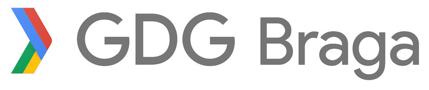

Help make this amazing, contribute adding any suggestions in the GitHub issues.

If you want to make part of a meetup just check [How a meetup work](#how-a-meetup-work).

Join us on slack at `gdgbraga.slack.com`

# Meetups

### #2 - [Google I/O Extended ’17 (24/05/2017)](24052017-Google-IO-2017-Extended-Braga/MEETUP.md)

 Join us to find all about the hottest news of this year's Google I/O and also for talk about Android testing.

### #1 - [Next ’17 Extended - Braga (15/03/2017)](15032017-Next-17-Extendend-Braga/MEETUP.md)

 Join us to review and discuss one of the Next '17 sessions and also for another great talk about Google Cloud tools.

# How a meetup work

1. We get speakers, around 1-2 speakers per meetup;
2. The session will last around an hour;
3. We mainly would like to see what people are working on, whether it's a library, side project app, or some hack you want to share with others;
4. To be a speaker on a next meetup just send a PR to `interestedSpeakers.md` with your short bio and a very short outline of what you'd like to talk about. You can also send us an email with this info;
5. More to follow, stay tuned!

# Follow us

Follow us and stay updated with our latest news in the following social networks

[Meetup](https://www.meetup.com/GDG-Braga/)

[Facebook](https://www.facebook.com/GDGBraga)